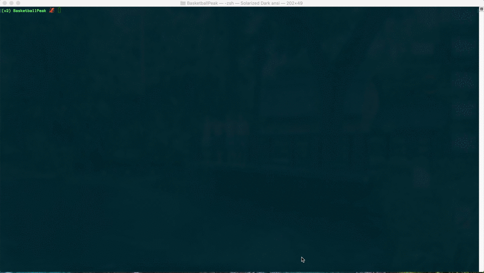

# Basketball Peak Finder

For basketball fans and sports fans who love 
statistics. This application finds the peak 
season of an NBA player's career and displays 
statistics and charts related to that player. 
It can find a player's peak performance in the
regular season and/or the postseason.


## Demo



## Installation

Make sure you have pip or another package manager
to install the neccessary dependencies.

```bash
pip install -r requirements.txt
```

## Usage

The current player database goes up to 2021-22 season.
To update the player database file:
```bash
python players.py
```

To run the application:
```bash
python peak_ui.py
```

## Support

For any suggestons or questions contact me via email: 
jackribarich@yahoo.com

## Author

Jack Ribarich

## Project Status

As of August 2020, the project GUI is finished, however, the 
calculation for the peak of player's career may be adjusted. 
